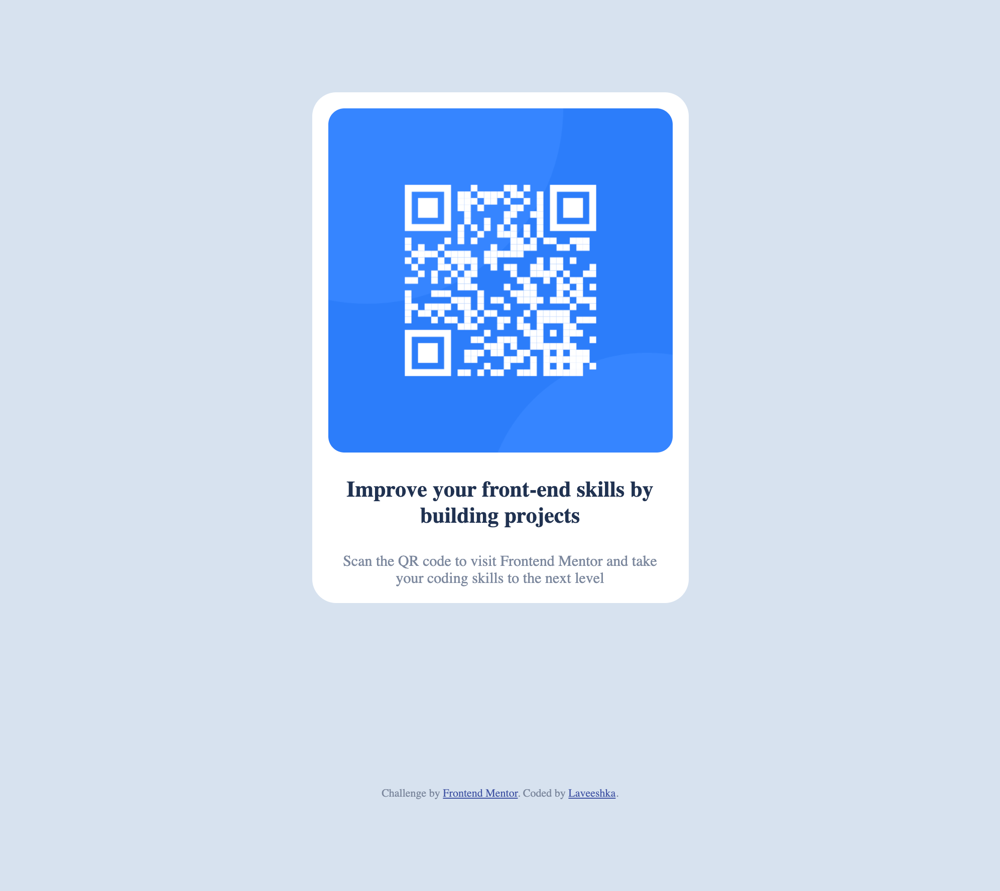

# Frontend Mentor - QR code component solution

This is a solution to the [QR code component challenge on Frontend Mentor](https://www.frontendmentor.io/challenges/qr-code-component-iux_sIO_H). Frontend Mentor challenges help you improve your coding skills by building realistic projects. 

## Table of contents

- [Overview](#overview)
  - [Screenshot](#screenshot)
  - [Links](#links)
- [My process](#my-process)
  - [Built with](#built-with)
  - [What I learned](#what-i-learned)
  - [Useful resources](#useful-resources)
- [Author](#author)


## Overview

### Screenshot



### Links

- [Live Site URL](https://qr-code-component-main-jade-ten.vercel.app/)

## My process

- Define html tags
- Add font face
- Define custom css variables
- Root fixes
- Body styling
- Component styling

### Built with

- HTML5 markup
- CSS custom properties
- CSS Grid

### What I learned

- I've learnt how to add a custom font face to my project
- I've also learnt how to set an image's height to be the same as its width

```css
@font-face {
    font-family: 'Outfit';
    font-display: swap;
    font-weight: 400, 700;
    src: url(https://fonts.google.com/specimen/Outfit);
}
img {
  aspect-ratio: 1/1;
}
```

### Useful resources

- [Set image height equal to its width](https://stackoverflow.com/questions/5445491/height-equal-to-dynamic-width-css-fluid-layout) - Check out the answer titled 'Best method now: the aspect-ratio property'. 

## Author

- Website - [Portfolio](https://laveeshka.github.io/my-personal-website/)
- Frontend Mentor - [@laveeshka](https://www.frontendmentor.io/profile/laveeshka)

